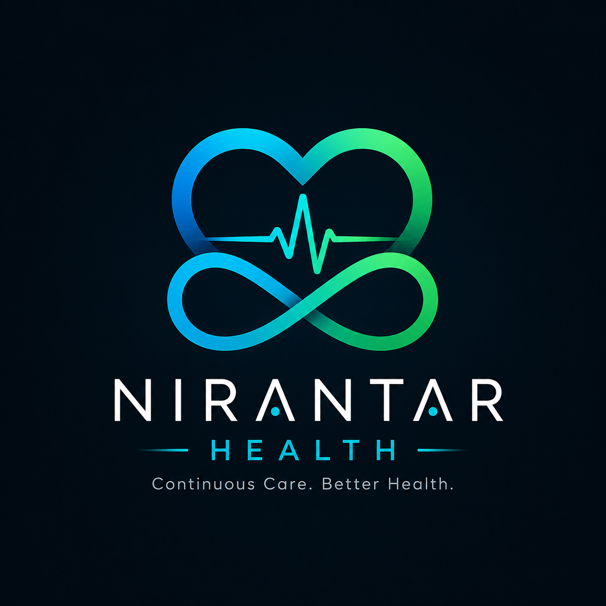
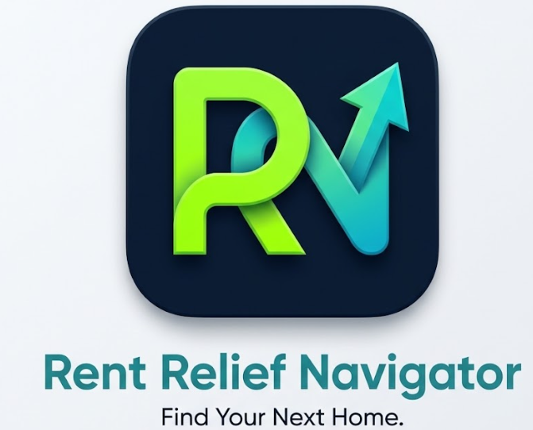

# Hi, I'm Ariha Shree

### Software Engineer • AI Developer • Full-Stack Developer

<p align="left">
  <a href="https://arihashree-portfolio.netlify.app/">
    
  </a>
  <a href="https://www.linkedin.com/in/ariha-shree-5505b9335/">
    
  </a>
  <a href="https://leetcode.com/u/maxCoder-15/">
    
  </a>
</p>

---

##  About Me

I'm a Computer Science undergraduate at **Vellore Institute of Technology (VIT)** passionate about building **AI-powered applications, scalable full-stack systems, and clean user experiences**.

-  B.Tech Computer Science & Engineering @ VIT
-  CGPA: **8.62**
-  Participated in **5+ Hackathons**
-  Building **AI & Full-Stack Projects**
-  **20+ Certifications**
-  Currently exploring **AI, Software Engineering & Cloud**
-  Open to **Internships & Collaborations**

---

##  What I Build

 AI-Powered Applications
 Full-Stack Web Applications
 Data-Driven Systems
 Cloud-Based Solutions
 FinTech & Student-Focused Products

 **Tech Stack**
### Languages

<p align="left">
  
</p>

### Frontend

<p align="left">
  
</p>

### Backend & Database

<p align="left">
  
</p>

### Tools & Cloud

<p align="left">
  
</p>

## Featured Projects

```html
 <p align="center">
  
</p>
```
 **CASHLENS — AI-Powered Finance Platform**

An AI-powered finance platform designed to simplify personal expense tracking and help users make smarter financial decisions.

**Highlights**

 OCR receipt scanning, reducing manual expense entry by 80%
 Built 15+ reusable React components for budgeting, transactions, and savings
 PostgreSQL database with 6+ entities and Row-Level Security (RLS)
 Integrated Tesseract.js OCR, AI spending predictions, offline sync, and chatbot
 Improved transaction capture by 60%

**Tech Stack**

React.js Vite Tailwind CSS Supabase PostgreSQL Tesseract.js AI

```html
<p align="center">
  
</p>
```
**** Nirantar Health Card — Healthcare Management Platform****

A full-stack healthcare platform for managing patients, appointments, laboratory records, and secure medical record sharing.
**Highlights**

 Built with React, Node.js, and PostgreSQL
 Developed 12+ responsive React components
 Implemented 55+ REST APIs for patient, appointment, and lab management
 Optimized PostgreSQL schema with 6+ entities and strategic indexing
 Implemented QR-based record sharing with JWT authorization
 Supported secure access across 4 user roles
 Eliminated 100% of duplicate booking errors

**Tech Stack**

React.js Node.js Express.js PostgreSQL REST APIs JWT
```html
 <p align="center">
  
</p>
```
** Rent Relief Navigator — AI Rental Intelligence Platform**

An AI-powered rental intelligence platform designed to simplify property evaluation, detect rental scams, and uncover hidden rental costs.
**Highlights**

 Reduced property evaluation time from 10–15 hours to less than 10 seconds
 Built a rental scam detection system targeting fraud losses of ₹35,000–₹3.5 lakh per victim
 Developed a cost analysis engine identifying 30–50% of hidden rental expenses
 Designed to scale from 4 metro cities to 50+ cities
 Targeting ₹50,000+ crore in annual rental fraud prevention

**Tech Stack**

React.js AI JavaScript REST APIs Data Analysis

##  GitHub Analytics

<p align="center">
  
  
</p>

---

##  GitHub Streak

<p align="center">
  
</p>

---

##  LeetCode

<p align="center">
  
</p>

## 📄 Resume

<p align="left">
  <a href="https://docs.google.com/document/d/1l0Dv4USt5-DEeX49aB1iZ-H1w06sg3U8eyPTytorCQA/edit?tab=t.0">
    
  </a>
</p>

---

##  Connect With Me

<p align="left">
  <a href="https://arihashree-portfolio.netlify.app/">
    
  </a>

  <a href="https://www.linkedin.com/in/ariha-shree-5505b9335/">
    
  </a>

  <a href="https://github.com/Ariha1510">
    
  </a>

  <a href="https://leetcode.com/u/maxCoder-15/">
    
  </a>
</p>

---

<p align="center">
  <i>Building ideas into impactful software </i>
</p>
:::
